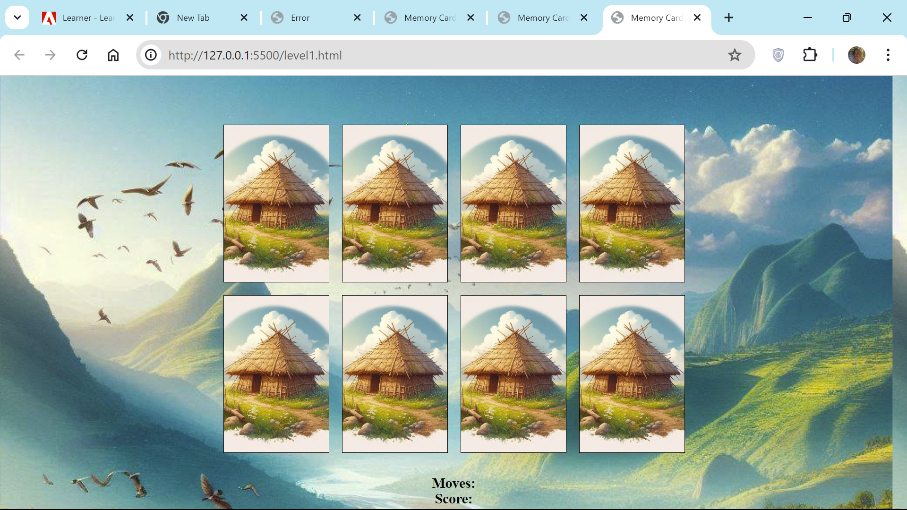
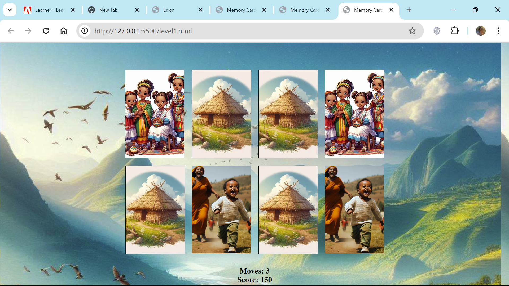

# Memory-card-game
The Memory Card Game is a fun and interactive web-based game where players match pairs of cards by flipping them over. This project demonstrates the use of HTML, CSS, and JavaScript to create a responsive and visually appealing memory game.

